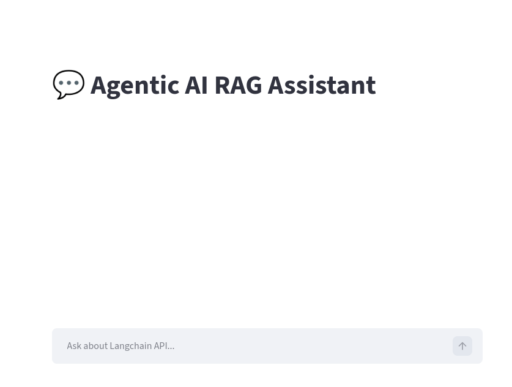

# Agentic AI RAG Helper

Agentic AI RAG Helper is a production-ready Retrieval-Augmented Generation (RAG) chatbot built with LangGraph, LangChain, and Qdrant, designed to help developers query **LangGraph, LangChain and Qdrant**  documentation, APIs, and code examples with **zero hallucinations**.

This project demonstrates how to build an Agentic AI system using graph-based reasoning, vector search, and LLM orchestration.

---
## Why this project?

Modern LLM apps fail when they hallucinate APIs, agents, or workflows.
This project solves that by:
* Retrieving real documentation from LangChain, LangGraph, and Qdrant
* Feeding only verified context to the LLM (RAG)
* Using LangGraph to orchestrate agentic reasoning
* Returning answers with sources for transparency

If you’re learning or building with:
* LangChain
* LangGraph
* Qdrant
* Agentic AI
* RAG systems

---

## Features

* Agentic AI architecture using LangGraph
* RAG-based chatbot grounded in real LangGraph documentation
* Semantic search powered by Qdrant vector database
* LLM-agnostic (via OpenRouter – supports OpenAI, Anthropic, Mistral, etc.)
* Streamlit chat UI with source citations
* FastAPI backend with clean API boundaries
* Strong hallucination control via retrieval grounding

---

## Requirements

* Python 3.13+
* Qdrant running on `localhost:6333`
* Install required Python packages:

```bash
pip install -r requirements.txt
```

---

## Configurations
* Create a **config.py** file in **app/backend**
* Contents of config.py
```bash
  OPENROUTER_API_KEY = "your_api_key"
  OPENROUTER_URL = "https://openrouter.ai/api/v1/chat/completions"
  OPENROUTER_MODEL = "openai/gpt-4o-mini"
  QDRANT_URL = "http://localhost:6333"
```
* LLM can be used based on choice like any model and provider OPENROUTER

---

## Prerequisites
* Preform the step below
```bash
cd app/backend/rag
python3 lang_chain_store.py
python3 qdrant_store.py
```
* This step is necessary for data ingestion and database creation.
* Skipping this step can result in No documentation of the query by chatbot

---

## Starting the Backend

Navigate to the root of the project and run:

```bash
cd app/backend
uvicorn main:app --reload
```

* **Backend URL:** `http://localhost:8000`
* Provides `/api/v1/chat` endpoint for frontend to query.
* Health check endpoint available at `/api/v1/health`.
* Interactive API documentation at `/docs`.

---

## Starting the Frontend

Run the Streamlit frontend:

```bash
cd app/frontend
streamlit run chat_ui.py --server.port 8600
```

* **Frontend URL:** `http://localhost:8600`
* Chat interface to type questions and get answers.
* Displays source documents from LangGraph used to generate answers.

## Snapshot of the UI


---

## How it works

1. **Frontend**: User enters a question in the chat UI.
2. **Backend**: Receives the question and queries LangGraph vector database for relevant documents.
3. **LLM**: Backend sends the question and retrieved context to OpenRouter LLM.
4. **Response**: Backend returns the answer to frontend.
5. **Frontend**: Displays answer with source information for transparency.

This ensures answers are **grounded in actual documentation** and reduces hallucination.

---

## Usage Example

### Ask questions like:
 * How do I create an agent using LangGraph?
 * Explain LangGraph short-term memory APIs
 * How does LangChain retrieval work with Qdrant?
 * Show an example of a LangGraph workflow
 * How to store and query embeddings in Qdrant?

---

## Notes

* Ensure Qdrant is running and the collections are populated.
* Ensure your OpenRouter API key is set in the backend environment.
* Frontend and backend communicate via HTTP; frontend never talks to Qdrant directly.
* If running the Qdrant database locally use the image with command.
  
```bash
docker run -p 6333:6333 -p 6334:6334 \
    -v $(pwd)/qdrant_data:/qdrant/storage \
    qdrant/qdrant
```

---

## Help & Support

For issues or help:

* Check that all dependencies are installed.
* Ensure the correct ports are used (`8000` backend, `8600` frontend).
* Verify LangGraph collections exist and are populated with documents.
* OpenRouter LLM API key should be valid
